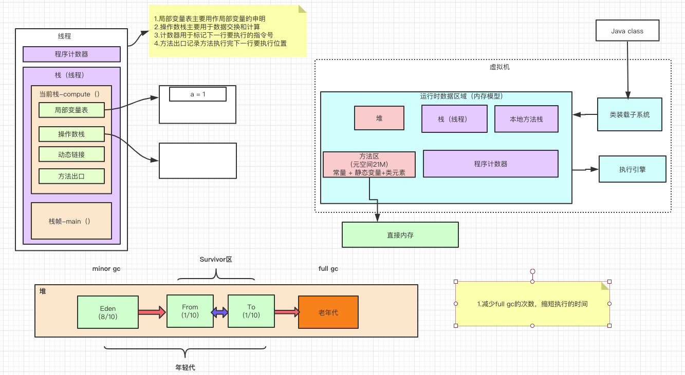
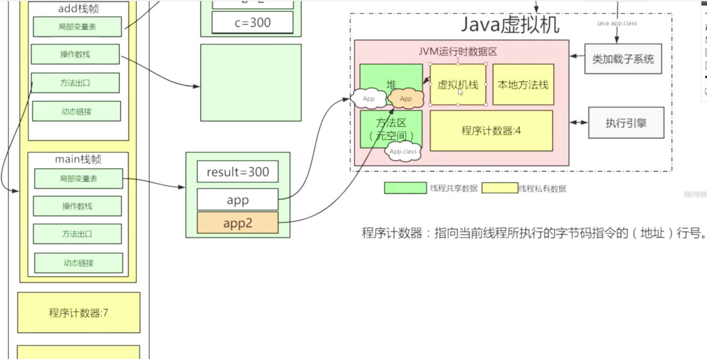
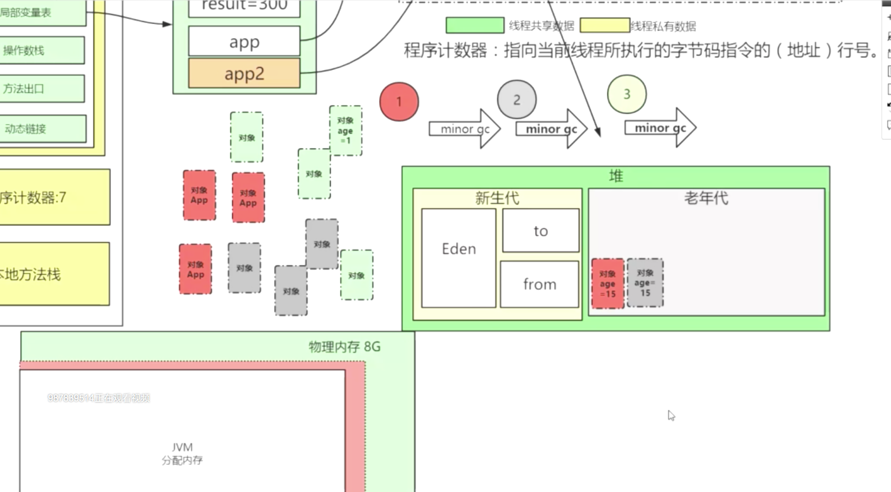
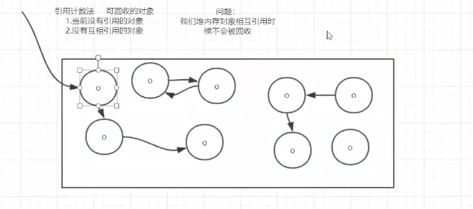
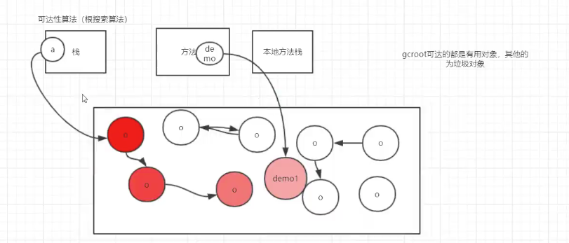
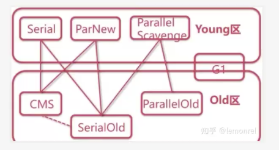
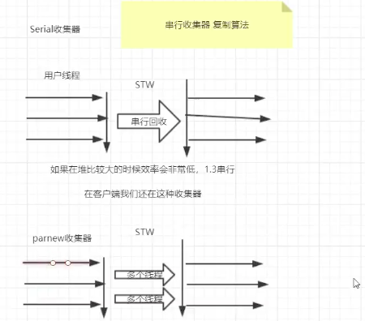
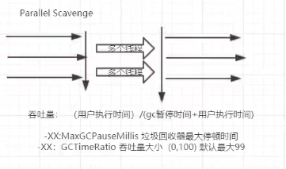
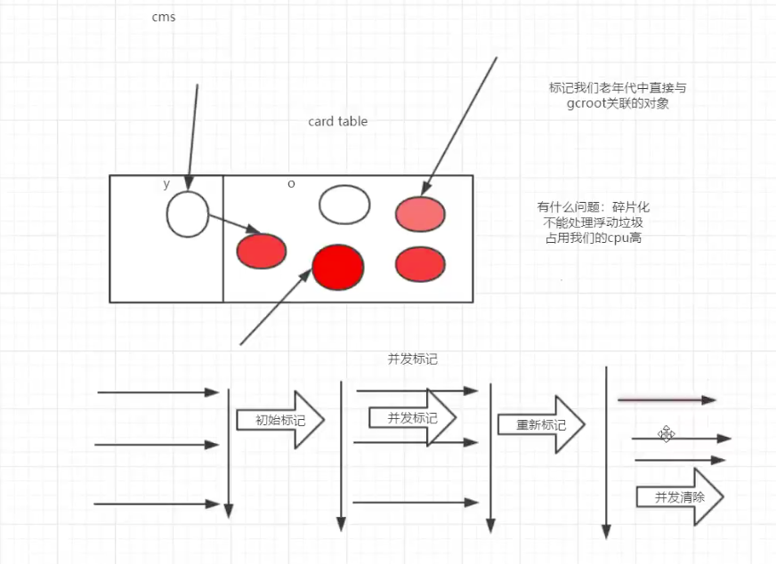

# java 虚拟机原理

## java虚拟机运行图

- 堆&方法区 线程共享数据
- 虚拟机栈&本地方法栈（JNI）&程序计数器 线程私有数据
- 程序计数器：指向当前线程所执行的字节码指令的（地址）行号 
- 对象age=15的时候会放到老年代
- 新生代：老年代 = 2：3，Eden：Survivor = 1:3
- 老年代出发 FULL GC（MAJOR GC），触发是会发生 STW（stop the word）

# 对象开辟空
- 指针碰撞，多线程使用cas
- 空闲列表，不够使用通过cas重新开辟一片比较大的区域，把之前的转移到新的空间
- 栈上分配，某个对象只在方法内使用，是栈私有的
- 内存逃逸，在方法内创建对象，外部需要使用，这样就会产生内存逃逸
- 对象组成部分：对象头（hash值、分代年龄、持有的锁（当前线程的ID）、类型指针（方法去的class对象））、实例数据（对象属性）、填充数据（Java虚拟机）
- 对象引用方式，直接引用、句柄引用（当对象重新创建时不需要改变对象引用）

# jvm垃圾回收
**判断是否要回收** 
- 引用计数法   

当前没有应用的对象    
没有互相引用的对象  
 问题：对内存中相互引用的对象不会被回收
- 可达性算法（根搜索算法）  
 非gcroot能够可达的都是要回收的对象 
  
- 复制算法（年轻代），eden满了之后会转移到from区，age+1，达到15次后移到老年代
- 标记压缩算法（老年代），标记可达对象   
  缺点：速度满，stw（stop the word）  
- 标记清除问题：碎片化严重

** 垃圾收集器**
 
   
paraller scavenge 收集器关注的是吞吐量
 
cms收集器：标记清除算法，用户和GC在一段时间并行执行，不会在老年代占满时去回收，占用68%会采用cms回收，支持重新标记之前执行一次miron GC，碎片占满之后会执行一次full GC（采用标记整理算法回收）
缺点：碎片化、不能处理浮动垃圾、占用CPU高
> 步骤：   
> - 初始标记：标记老年代直接与GCRoot关联的对象，会stw    
> - 并发标记：用户线程和GC一起执行，标记GCRoot下关联的对象  
> - 重新标记：扫描所有对象，标记可达对象  
> - 并发清除：用户线程一起清除不用的对象
  

