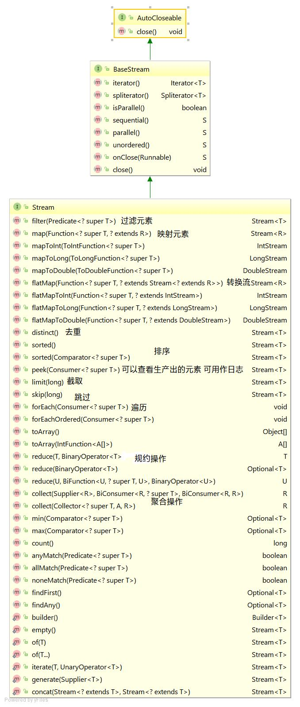
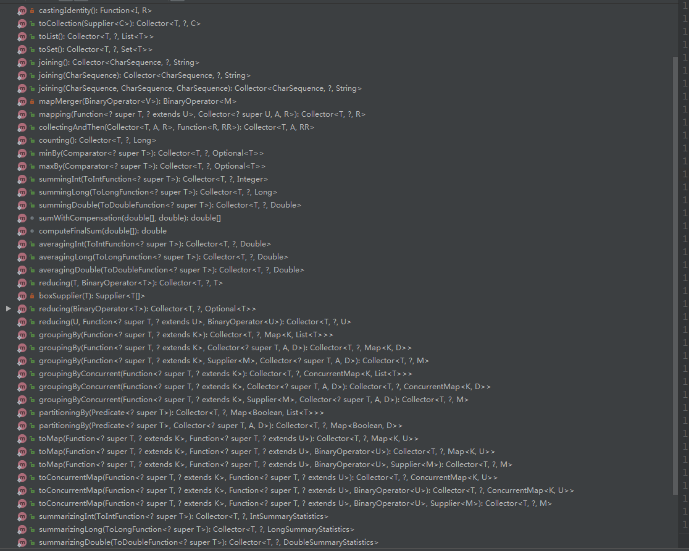

# stream

## stream 简介

stream是java8推出的流模式编程，可以理解为是流水线式的工作，跟流水线差不多；支持并行操作，这个可以看做是两条流水线工作。

## 为什么选用

- 代码整洁可维护
- 函数式编程让代码写起来很爽，不在枯燥的for循环
- 性能提升不用维护，随着jdk版本的提升随之提升
- 大数据量面前有很强的优势（据说速度比for循环宽好多）
- 支持并行操作

## 环境要求
  JDK8 以上

## 怎么使用

### 主要操作对象
- 集合类（collections，list，set）
- 构建集合类对象
```
Stream.of("a1", "a2", "a3")
  .findFirst()
  .ifPresent(System.out::println);
  //a1
```
- API提供的对象（IntStream，LongStream，DoubleStream)
```
IntStream.range(1, 4)
  .forEach(System.out::println);
// 1
// 2
// 3
```
### stream重要方法说明
- map 根据传入的对象处理之后返回新的对象
```
Stream.of("a1", "a2", "a3").map(s->{
           if(StringUtils.startsWith(s,"a")){
               return s;
           }else{
               return null;
           }
       }).collect(Collectors.toList());
```
- flatMap 传入对象返回一个新的 stream 链
```
Stream.of(Lists.newArrayList(Lists.newArrayList("a1", "a2", "a3"),
                Lists.newArrayList("b1", "b2", "b3"),
                Lists.newArrayList("c1", "c2", "c3")))
                .flatMap(s -> s.stream()).flatMap(d -> d.stream()).map(s -> {
            if (StringUtils.startsWith(s, "a")) {
                return s;
            } else {
                return null;
            }
        }).filter(Objects::nonNull).collect(Collectors.toList());
```
- filter 过滤不需要的
```
Stream.of("a1", "a2", "a3").map(s->{
            if(StringUtils.startsWith(s,"a")){
                return s;
            }else{
                return null;
            }
        }).filter(Objects::nonNull).collect(Collectors.toList());
```
- sorted 排序
```
Stream.of("c", "b", "a").sorted(Comparator.naturalOrder())
                .peek(System.out::println).collect(Collectors.toList());
//a
//b
//c
```
- distinct 去重
```
Stream.of("c", "c", "a").distinct()
                .peek(System.out::println).collect(Collectors.toList());
//c
//a              
```
- Collect 终端操作 收集转换想要的结果
```
Stream.of("c", "b", "a").sorted(Comparator.naturalOrder())
                .peek(System.out::println).collect(Collectors.toList());
```
- reduce 数据合并
```
//第一种
String result = Stream.of("d2", "a2", "b1", "b3", "c").reduce((a,b)->a+b).get();
        System.out.println(result);
//d2a2b1b3c
//第二种
String result = Stream.of("d2", "a2", "b1", "b3", "c")
    .reduce(new String("e"),(s,a)-> s + a);
    System.out.println(result);
//ed2a2b1b3c
//第三种
String result = Stream.of("d2", "a2", "b1", "b3", "c").reduce(new String(""),(s,a)-> {
            System.out.println("s=" + s + "; a=" + a);
            return "e" + s + a;
        },(a,b)->{
            System.out.println("a=" + a + ";b=" + b);
            return "f" + a + b;
        });
        System.out.println(result);
//s=; a=d2
//s=eed2a2; a=b1
//s=eeed2a2b1; a=b3
//s=eeeed2a2b1b3; a=c
//eeeeed2a2b1b3c      
```

### 图片展示


### stream 链重用
*** 可以通过Supplier构建Stream链 ***
```
Supplier<Stream<String>> streamSupplier =
               () -> Stream.of("d2", "a2", "b1", "b3", "c")
                       .filter(s -> s.startsWith("a"));

       streamSupplier.get().anyMatch(s-> true);   // ok
       streamSupplier.get().noneMatch(s -> true);  // ok
```

## Collectors 说明
### 常用方法
- toList 汇总成List集合
- toSet 汇总成Set集合
- toMap 转换成Map集合
- joining 连接返回的的数据流
- groupingBy


### 图片展示


** 注: **
- 中间是操作(可有可无)
- 最后是收尾(可有可无)
```
  englishNameToMetadataUuidMap = metadataList.stream().collect(Collectors.toMap(WorkflowMetadata::getFieldEnName,WorkflowMetadata::getMetadataUuid));

  List<String> metadataEnglishNameList = formDataDTOList.stream().map(WorkflowFormDataDTO::getFieldEnName).filter(StringUtils::isNotEmpty).collect(Collectors.toList());
```
- 顺序要看重（尤其数据量很大的时候）
```
Stream.of("d2", "a2", "b1", "b3", "c")
    .map(s -> {
        System.out.println("map: " + s);
        return s.toUpperCase();
    })
    .filter(s -> {
        System.out.println("filter: " + s);
        return s.startsWith("A");
    })
    .forEach(s -> System.out.println("forEach: " + s));

    // map:     d2
    // filter:  D2
    // map:     a2
    // filter:  A2
    // forEach: A2
    // map:     b1
    // filter:  B1
    // map:     b3
    // filter:  B3
    // map:     c
    // filter:  C

  //顺序颠倒之后
    Stream.of("d2", "a2", "b1", "b3", "c")
        .filter(s -> {
            System.out.println("filter: " + s);
            return s.startsWith("a");
        })
        .map(s -> {
            System.out.println("map: " + s);
            return s.toUpperCase();
        })
        .forEach(s -> System.out.println("forEach: " + s));

    // filter:  d2
    // filter:  a2
    // map:     a2
    // forEach: A2
    // filter:  b1
    // filter:  b3
    // filter:  c
```
