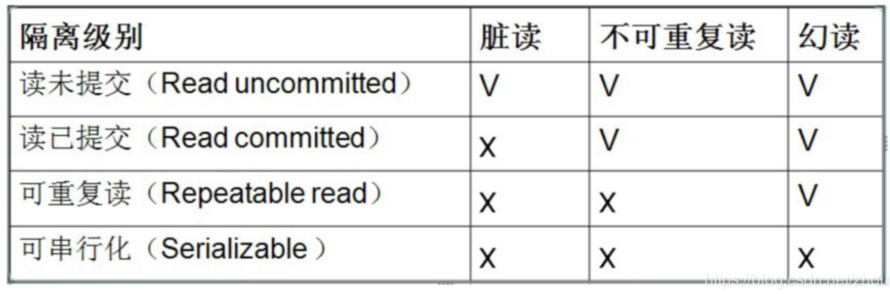

# 事务说明

## 事务的四大特性

- 原子性
- 一致性
- 隔离性
- 持久性

## 事务的隔离级别
- read uncommitted（读未提交）

``` 解决了更新丢失，但还是可能出现脏读 ```
- read commited（读提交）
  
``` 解决了更新丢失和脏读问题 ```
- repeatable read（可重复读取）

``` 解决了更新丢失、脏读、不可重复读，但是还会出现幻读 ```
- serializable（可序化）

``` 解决了更新丢失、脏读、不可重读、幻读（虚读） ```



mysql 数据库默认的是 第三隔离级别（repeatable read）